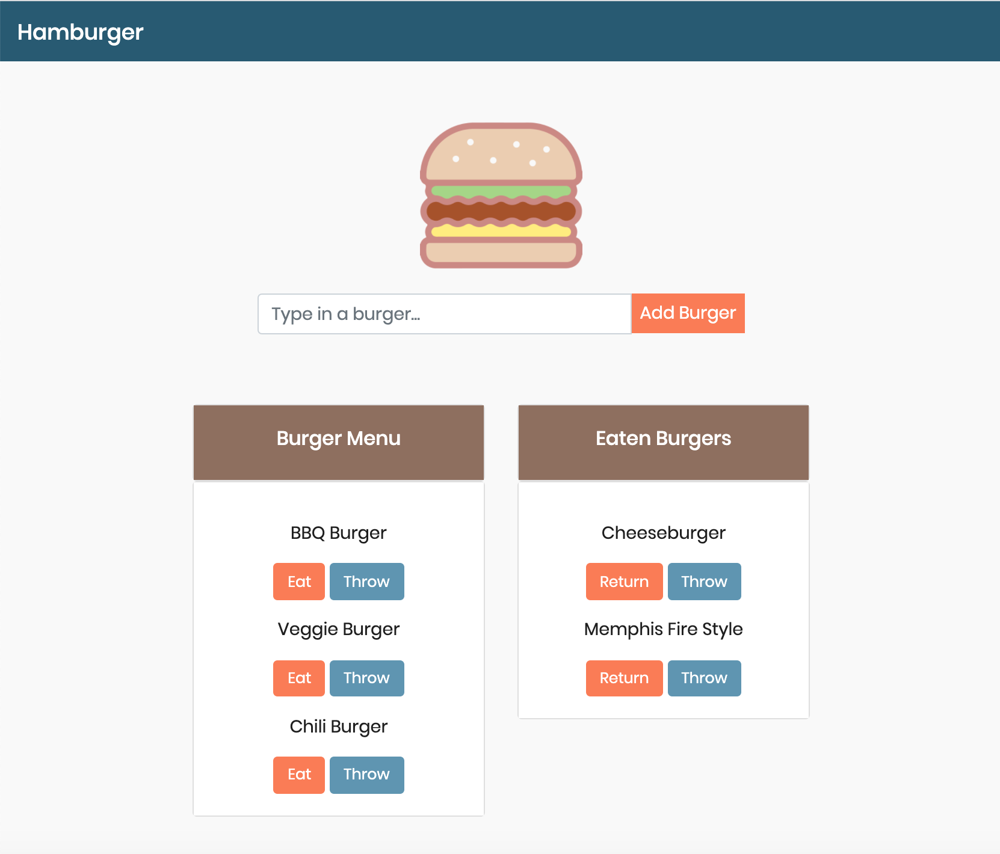

# Hamburger App

## Project Description:
Created an app that lists different types of burger, where the users are able to manipulate the list by adding to it or deleting an item. The app was made using MySQL, Node, Express, Handlebars and a customized ORM.

## Installation:
* Express
* Express Handlebars
* MySQL

## Usage:
The user is first presented with a list of burgers that were previously added. Then, the user is able to add to the list of burgers. The user can also re-arrange the burgers by putting a burger(s) in the "eaten" column by clicking on the "eat" button OR remove burgers from each column by clicking on the "remove" button. 

## Contributing:
* Burger Icon from <a href="https://www.flaticon.com/authors/freepik" title="Freepik">Freepik</a> from <a href="https://www.flaticon.com/" title="Flaticon"> www.flaticon.com</a>

## Project Preview:
The app looks like the image below

## Project Link:
https://limitless-cliffs-49808.herokuapp.com
